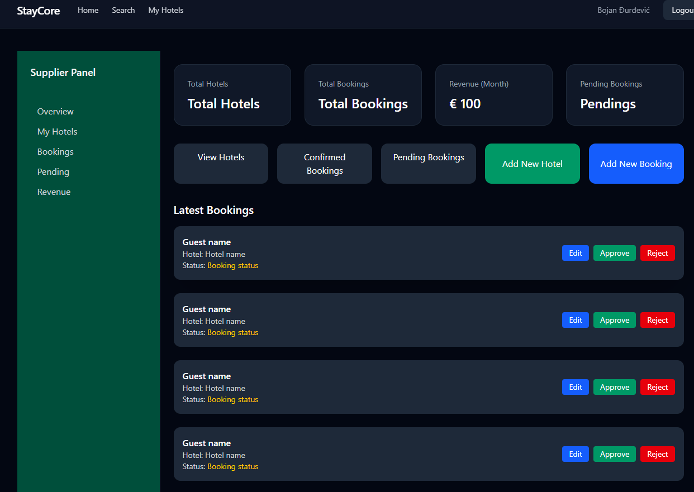
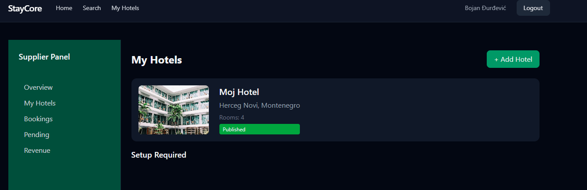
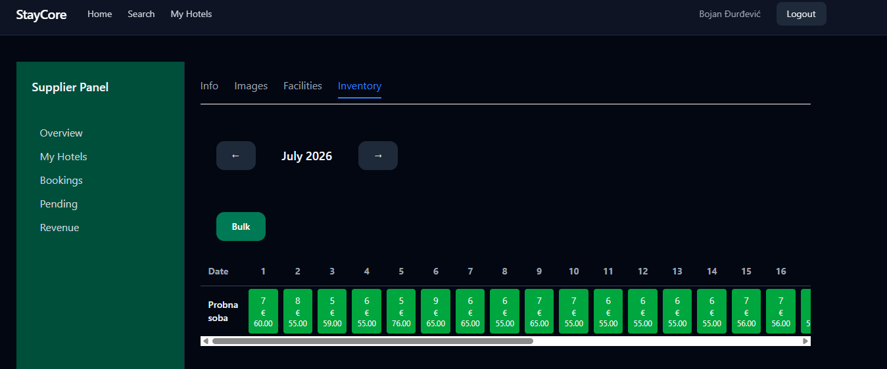
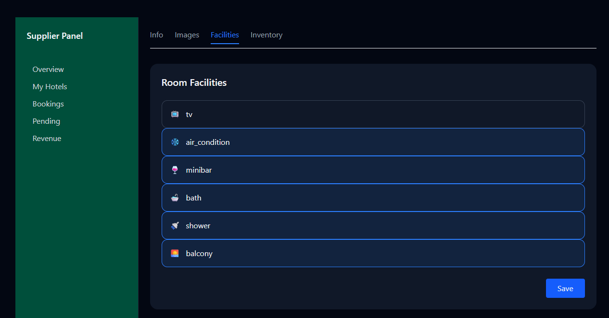
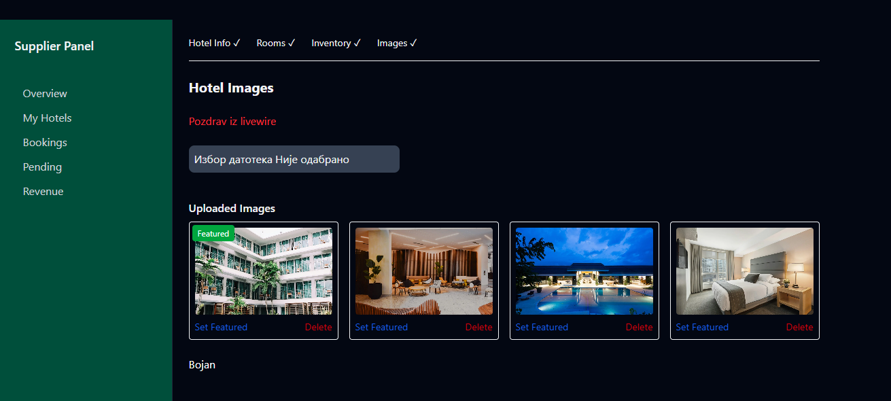

# BookYourHotel



A multi-hotel SaaS platform for managing hotel operations, room inventory, availability and pricing.

Built with Laravel, Livewire, Alpine.js and Tailwind CSS.

---

## Overview

BookYourHotel is a hotel management platform designed for accommodation providers who need a flexible solution for managing their properties.

The application provides tools for managing hotels, rooms, availability, pricing and reservations through an interactive dashboard.

The project was built with scalability in mind, following Laravel best practices and a modular architecture that allows future expansion into a complete booking ecosystem.

---

# Features

## Hotel & Room Management

- Create and manage hotels
- Manage rooms and room types
- Configure room capacity and pricing
- Upload hotel and room images
- Manage facilities and room information


## Inventory Management

The core of the system is a date-based inventory management system.

Features include:

- Calendar-based availability management
- Daily room inventory tracking
- Price updates per date
- Bulk availability and pricing updates
- Support for seasonal pricing strategies


## Reservation System

- Availability checking before booking
- Room allocation logic
- Reservation management
- Booking history tracking


## User Roles

The application is designed with multiple user roles:

- Super Admin
- Hotel Supplier
- Customer

Each role has different permissions and access levels.

---

# Technical Highlights

## Dynamic Inventory System

Implemented a date-based room availability system where inventory is managed according to:

- Room capacity
- Selected date ranges
- Existing reservations
- Availability changes


## Flexible Pricing Model

Designed a pricing structure supporting:

- Base room prices
- Date-based price changes
- Future seasonal pricing strategies


## Interactive Dashboard

Built a responsive management dashboard using:

- Laravel Livewire
- Alpine.js
- Tailwind CSS

The interface provides fast interactions without requiring a separate SPA.

---

# Tech Stack

## Backend

- PHP
- Laravel
- MySQL
- Eloquent ORM


## Frontend

- Livewire
- Alpine.js
- Tailwind CSS


## Development Tools

- Vite
- Composer
- Git

---

# Architecture

The application follows Laravel MVC architecture with:

- Eloquent relationships
- Form validation
- Reusable Livewire components
- Modular business logic
- Clear separation between application layers

---

# Screenshots

## Dashboard




## Inventory Calendar




## Room Management



## Images Management



---

# Installation

Clone repository:

```bash
git clone https://github.com/BojanDjurdjevic/BokYourHotel.git

composer install

pnpm install

cp .env.example .env

php artisan key:generate

php artisan migrate

php artisan serve

pnpm dev