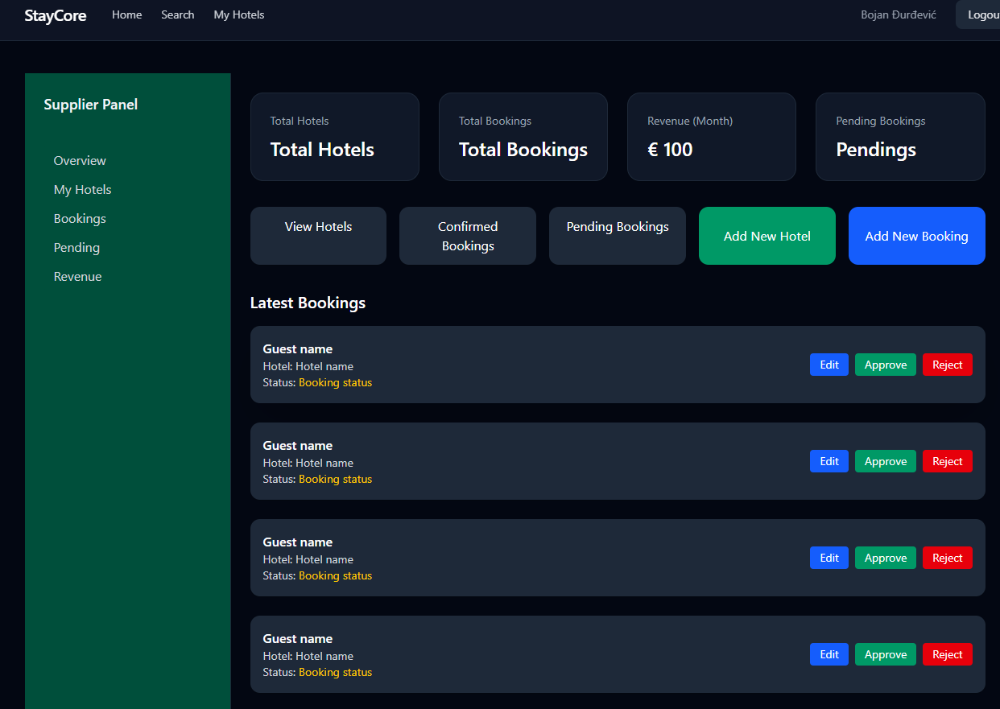
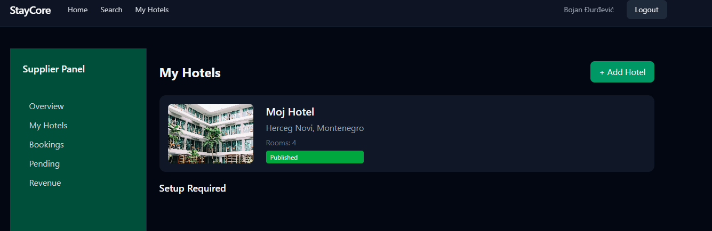
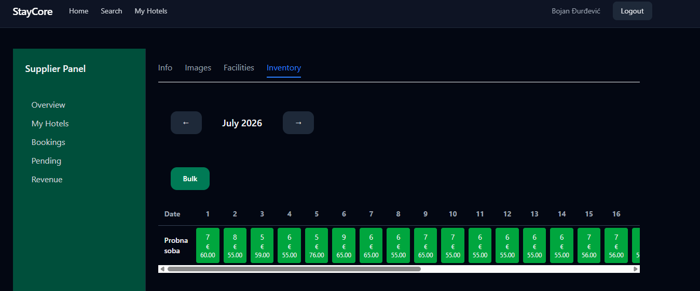
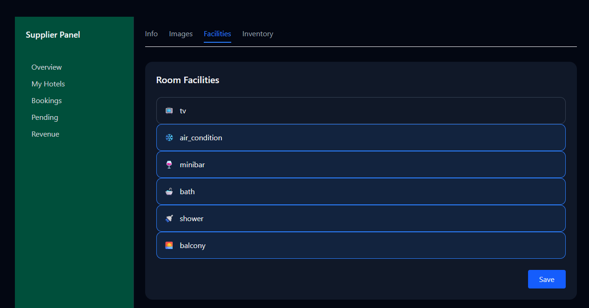
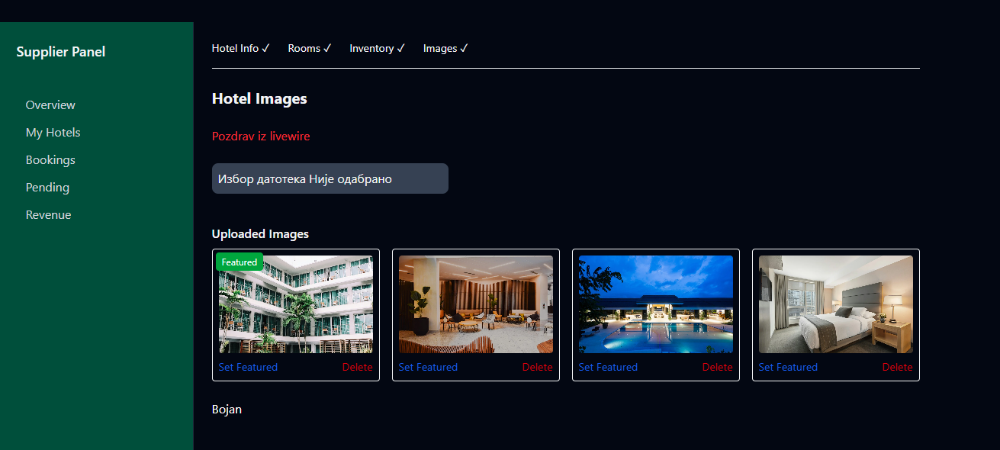

# BookYourHotel



**BookYourHotel** is a hotel booking and supplier management SaaS-style portfolio MVP.

## [Live Demo](https://bookyourhotelapp.com)

The deployed application uses simulated payments only; no real money is charged.

Customers and guests can search hotels, check availability, create a booking, use a simulated payment flow and receive a voucher. Suppliers manage hotels, rooms, facilities, images, inventory and bookings. The platform also includes guest booking recovery, notifications and transaction-safe booking and inventory operations.

## Screenshots

The repository currently includes these portfolio screenshots:






Dedicated captures for hotel details/gallery, booking/payment, notifications and the supplier mobile navigation are still recommended for the portfolio presentation.

## Key engineering features

- Database transactions and `lockForUpdate` protection for booking and inventory changes
- Overbooking protection, stale inventory detection and concurrent cancellation/confirmation safety
- Booking expiration with idempotent inventory restoration
- Signed guest management links and generic guest booking recovery responses
- Preserved booking, payment and voucher history
- Fake payment and refund simulation; no real payment provider is included
- Queue-backed database notifications and voucher generation
- GD/Intervention Image WebP processing for supplier uploads
- Deterministic, idempotent fictional demo media importer
- Faceted hotel search/filtering with measured query optimizations
- Supplier archive/deactivate lifecycle with restrictive history foreign keys
- PHP, frontend and opt-in MySQL concurrency/lifecycle tests

## Product flows

| Customer / Guest | Supplier | Platform |
| --- | --- | --- |
| Search → availability → booking → simulated payment → voucher | Hotels → rooms → facilities → inventory → bookings | Guest recovery → notifications → concurrency-safe booking/inventory logic |

## Architecture

The main request path is:

`Controller → Form Request / Policy → Service layer → Eloquent / database transaction`

Public, authenticated user and supplier flows share domain services and policy rules. Booking and payment have separate lifecycle models, while booking items preserve the values shown at booking time.

## Tech stack

- PHP 8.2+
- Laravel 12 and Eloquent ORM
- MySQL
- Laravel Breeze
- Livewire and Alpine.js
- Tailwind CSS and Vite
- Laravel queues and notifications
- Intervention Image with the GD driver
- PHPUnit and Node's built-in test runner

## Local setup

```bash
git clone https://github.com/BojanDjurdjevic/BokYourHotel.git
cd BokYourHotel
composer install
pnpm install
cp .env.example .env
php artisan key:generate
php artisan migrate
php artisan storage:link
php artisan serve
pnpm dev
```

Configure the database and mail values in `.env`. For SMTP, use Laravel's standard `MAIL_MAILER`, `MAIL_HOST`, `MAIL_PORT`, `MAIL_USERNAME`, `MAIL_PASSWORD`, `MAIL_ENCRYPTION`, `MAIL_FROM_ADDRESS` and `MAIL_FROM_NAME` settings. For local queued notifications, run:

```bash
php artisan queue:work --queue=default --tries=3 --timeout=60
php artisan schedule:work
```

For a production frontend bundle, run `pnpm build`.

## Demo data

```bash
php artisan demo:seed
php artisan demo:images
```

Demo hotels, suppliers, bookings and images are fictional. Images are generated portfolio assets with local provenance. The media importer is deterministic and idempotent. The payment flow is a local simulator. The demo catalog cleanup command, when needed for a local database, is `php artisan demo:catalog --apply`.

Known demo credentials are documented in the local project documentation only; never use them in a production database.

## Testing

```bash
php artisan test
node --test tests/Frontend/*.test.mjs
```

The MySQL suites are opt-in because they require a prepared MySQL test database:

```powershell
$env:RUN_BOOKING_MYSQL_TESTS='1'
php artisan test tests/Feature/BookingManagementConcurrencyTest.php
$env:RUN_LIFECYCLE_MYSQL_TESTS='1'
php artisan test tests/Feature/SupplierLifecycleMySqlTest.php
```

## Deployment notes

Use `APP_ENV=production`, `APP_DEBUG=false`, a correct HTTPS `APP_URL`, production database settings, SMTP secrets, a supervised queue worker and the scheduler. Configure persistent storage and the storage link, backups, logs and application secrets before deployment.

## Limitations

Payment is a simulator: there is no real provider, webhook or reconciliation flow. Admin operations are limited. This is a portfolio MVP, not a Booking.com replacement, and a production deployment still needs normal operational setup, monitoring, backups and privacy decisions.
